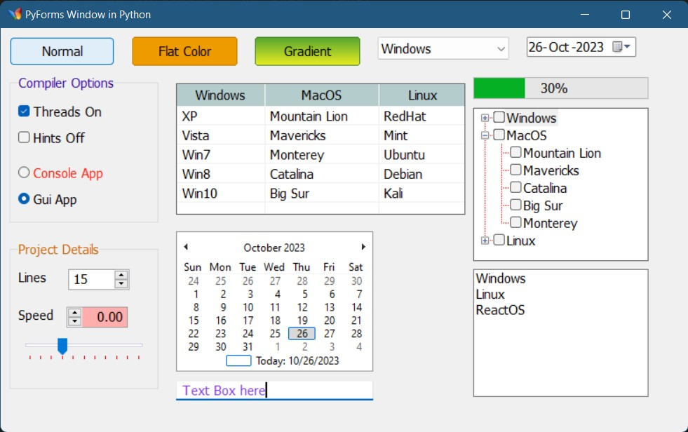

# Pyforms
Window GUI lib for Python, based on Win32 API.

# How to use ?
    Just download the pyforms folder and place it near your python script.
    Import it and voilà!

# Screenshots



## This code is used to create the window in above screenshot

```python
from pyforms import Form, Button, TextBox, Label, ComboBox, ListBox, CheckBox, RadioButton, DateTimePicker, NumberPicker
from pyforms import TrackBar, ListView, TreeView, ChannelStyle, GroupBox, ProgressBar, CalendarBox, connect
from pyforms import ViewMode, FormPosition
from horology import Timing
import sys
import datetime as dt

def main():
    global frm, tk, pgb

    frm = Form("PyForms Window in Python", 800, 500)
    frm.onMouseDown = lambda f, e: frm.printPoint(e)
    frm.createHandle()

    b1 = Button(frm, "Normal", 10, 10, auto= True)
    b2 = Button(frm, "Flat Color", b1.right + 20, 10)
    b2.backColor = 0xee9b00
    b3 = Button(frm, "Gradient", b2.right + 20, 10)
    b3.setGradientColor(0x55a630, 0xeeef20)

    cmb = ComboBox(frm, b3.right + 20, 10, auto = True, items = ["Windows", "Linux", "ReactOS"])
    cmb.selectedIndex = 0

    dtp = DateTimePicker(frm, cmb.right + 20, 10)

    gb = GroupBox(frm, "Compiler Options", 10, b1.bottom + 10, width=170, height=170, auto=True)
    gb.foreColor = 0x3a0ca3

    cb1 = CheckBox(frm, "Threads On", 20, gb.ypos + 32, auto=True)
    cb2 = CheckBox(frm, "Hints Off", 20, cb1.bottom + 10, auto=True)
    rb1 = RadioButton(frm, "Console App", 20, cb2.bottom + 20, auto=True)
    rb2 = RadioButton(frm, "Gui App", 20, rb1.bottom + 10)
    rb1.foreColor = 0xFF2512

    gb2 = GroupBox(frm, "Project Details", 10, gb.bottom + 20, width=170, height=170, auto=True)
    gb2.foreColor = 0xca6702

    lb1 = Label(frm, "Lines", 20, gb2.ypos + 32, auto=True)
    np1 = NumberPicker(frm, lb1.right + 20, gb2.ypos + 32)

    lb2 = Label(frm, "Copies", 20, lb1.bottom + 20, auto=True)
    np2 = NumberPicker(frm, lb2.right + 10, lb1.bottom + 20)
    np2.buttonOnLeft = True
    np2.backColor = 0xffadad

    lv = ListView(frm, gb.right + 20, b1.bottom + 20, 330, 150, True, ["Windows", "MacOS", "Linux", 100, 130, 100])
    lv.addRow("XP", "Mountain Lion", "RedHat")
    lv.addRow("Vista", "Mavericks", "Mint")
    lv.addRow("Win7", "Monterey", "Ubuntu")
    lv.addRow("Win8", "Catalina", "Debian")
    lv.addRow("Win10", "Big Sur", "Kali")

    cal = CalendarBox(frm, gb.right + 20, lv.bottom + 20, auto = True)

    tk = TrackBar(frm, 20, np2.bottom + 10, 150, 40)
    tk.ticColor = 0xFF0012
    tk.channelStyle = ChannelStyle.OUTLINE

    pgb = ProgressBar(frm, lv.right + 10, cmb.bottom + 20, 200)

    tv = TreeView(frm, lv.right + 10, pgb.bottom + 10, 200, 200, True)
    tv.addNodeWithChilds("Windows", "Vista", "Win7", "Win8", "Win10", "Win11")
    tv.addNodeWithChilds("MacOS", "Mountain Lion", "Mavericks", "Catalina", "Big Sur", "Monterey")
    tv.addNodeWithChilds("Linux", "RedHat", "Mint", "Ubuntu", "Debian", "Kali")

    lbx = ListBox(frm, lv.right + 10, tv.bottom + 10, 200, 150, auto=True)
    lbx.addItems("Windows", "Linux", "ReactOS")

    tb = TextBox(frm, gb2.right + 20, cal.bottom + 10, cal.width, auto=True)
    tb.foreColor = 0x8338ec


if is_main_module :
    with Timing("Total time taken for forms and controls: "):
        main()
        @connect(tk, "onValueChanged") # When track bar value changed, the progress bar will show it.
        def onTrackChanged(c, e):
            pgb.value = tk.value

    frm.display()

```
